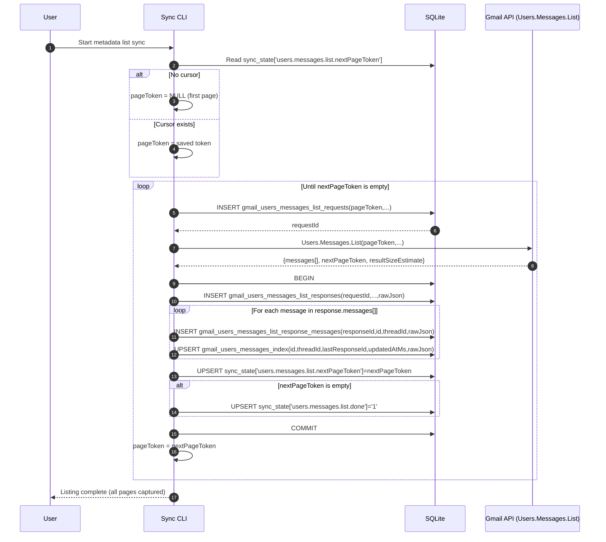

# Architecture V2 Plan

## Gmail API Mirror Schema (Requests + Responses Only)

Only store data needed to reflect `Users.Messages.List` request/response flow.

```sql
PRAGMA foreign_keys = ON;

-- One row per Users.Messages.List request attempt
CREATE TABLE IF NOT EXISTS gmail_users_messages_list_requests (
  id INTEGER PRIMARY KEY AUTOINCREMENT,
  pageToken TEXT,                 -- request.pageToken (NULL for first page)
  labelIdsJson TEXT,              -- request.labelIds (JSON array) if used
  q TEXT,                         -- request.q if used
  maxResults INTEGER,             -- request.maxResults if used
  requestedAtMs INTEGER NOT NULL
);

-- One row per Users.Messages.List response
CREATE TABLE IF NOT EXISTS gmail_users_messages_list_responses (
  id INTEGER PRIMARY KEY AUTOINCREMENT,
  requestId INTEGER NOT NULL REFERENCES gmail_users_messages_list_requests(id),
  nextPageToken TEXT,             -- response.nextPageToken
  resultSizeEstimate INTEGER,     -- response.resultSizeEstimate
  receivedAtMs INTEGER NOT NULL,
  rawJson TEXT NOT NULL           -- full ListMessagesResponse JSON
);

-- One row per response.messages[] entry (Message from list endpoint)
CREATE TABLE IF NOT EXISTS gmail_users_messages_list_response_messages (
  responseId INTEGER NOT NULL REFERENCES gmail_users_messages_list_responses(id),
  id TEXT NOT NULL,               -- message.id
  threadId TEXT,                  -- message.threadId
  rawJson TEXT NOT NULL,          -- full message object as returned by list
  PRIMARY KEY (responseId, id)
);

-- Canonical latest projection by Gmail message id (deduped view/table)
CREATE TABLE IF NOT EXISTS gmail_users_messages_index (
  id TEXT PRIMARY KEY,
  threadId TEXT,
  lastResponseId INTEGER NOT NULL REFERENCES gmail_users_messages_list_responses(id),
  updatedAtMs INTEGER NOT NULL,
  rawJson TEXT NOT NULL
);

CREATE INDEX IF NOT EXISTS idx_list_responses_requestId
  ON gmail_users_messages_list_responses(requestId);

CREATE INDEX IF NOT EXISTS idx_list_response_messages_responseId
  ON gmail_users_messages_list_response_messages(responseId);
```

## Resume Cursor (minimal)

```sql
CREATE TABLE IF NOT EXISTS sync_state (
  key TEXT PRIMARY KEY,
  value TEXT NOT NULL,
  updatedAtMs INTEGER NOT NULL
);
```

Keys used:
- `users.messages.list.nextPageToken`
- `users.messages.list.done`

## Interaction Diagram (list all pages)


